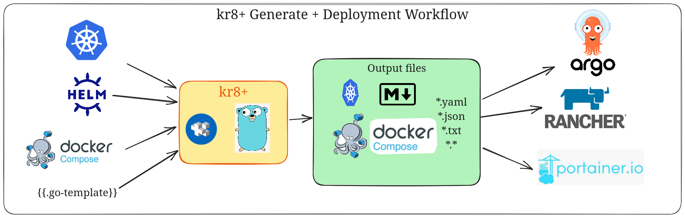

# kr8+


[](https://github.com/ice-bergtech/kr8p/actions?query=workflow%3ACI)


**kr8+** is an opinionated Kubernetes cluster configuration management tool designed to simplify and standardize the process of managing Kubernetes clusters.By leveraging best practices and providing a structured approach, **kr8+** helps DevOps teams streamline their workflows and maintain consistency across multiple environments.

**kr8+** is `pre-1.0`.
This means that breaking changes still happen from time to time, but it's stable enough for both scripting and interactive use in production environments.

<p align="center">
   <a href="https://github.com/ice-bergtech/kr8p/releases">Releases</a> ·
	<a href="./index.md">Documentation</a> ·
	<a href="https://github.com/ice-bergtech/kr8p/issues">Get Help</a>
</p>

## Menu

* [Key Features](#key-features)
* [Technical Overview](#technical-overview)
* [Installation](#installation)
  * [configuration](#configuration)
* [Full Documentation](./index.md)
* [Development](#development)

## Key Features

* **Cluster Configuration Management**: Manage Kubernetes clusters across environments, regions and platforms with a declarative and centralized approach.
* **Opinionated Structure**: Enforces best practices for consistent and reliable cluster configurations.
* **Jsonnet Native Funcitons**: Use jsonnet to render and override component config from multiple sources, such as templates, docker-compose files, Kustomize, and Helm.
* **Extensibility**: Easily extensible to meet the needs of diverse Kubernetes environments.
* **CI/CD Friendly**: Statically define all your configuration in a single source of truth, making it easy to integrate with CI/CD pipelines and deployment automation like ArgoCD.
* **Standardization**: Ensures consistency across Kubernetes clusters, reducing errors and improving maintainability.
* **Simplicity**: Provides a straightforward approach to complex Kubernetes configurations, making it easier for teams to adopt.
* **Scalability**: Designed to support clusters of all sizes, from simple single-node setups to large-scale production environments.



## Technical Overview

**kr8+** consists of:

- **kr8+** - a Go binary for rendering manifests
- [go-jsonnet](https://pkg.go.dev/github.com/google/go-jsonnet) `v0.20.0`
- [ghodss/yaml](https://github.com/ghodss/yaml) `v1.0.0`
- [Grafana/tanka helm](https://github.com/grafana/tanka/pkg/helm) `v0.27.1`
- [kubernetes/kompose](https://github.com/kubernetes/kompose) `v1.35.0`
- [Masterminds/sprig v3 Template Library](https://pkg.go.dev/github.com/Masterminds/sprig#section-readme) - [Template Documentation](https://masterminds.github.io/sprig/) `v3.2.3`


## Installation

The latest version is available for download from the [Github releases page](https://github.com/ice-bergtech/kr8p/releases)
To install via Homebrew, add the [icetech github tap](https://github.com/ice-bergtech/homebrew-icetech) and install::

```sh
brew tap ice-bergtech/icetech
brew install kr8p
```

Once installed, use `kr8p init` commands to setup the initial structure and configurations.

## Getting Started

An working example of a repo is found at [ice-bergtech/kr8p-examples](https://github.com/ice-bergtech/kr8p-examples):

```sh
git clone git@github.com:ice-bergtech/kr8p-examples.git
```

### Configuration

All configuration for **kr8+** is written in [Jsonnet](https://jsonnet.org/).
Jsonnet was chosen because it allows us to use code for configuration, while staying as close to JSON as possible.

A typical repo that uses **kr8+** has the following parts:

* Cluster Configurations
* Component Configurations
* Jsonnet Libraries

#### Clusters Configurations

A cluster is a deployment environment, organized in folders as a tree of configuration.
Configuration the folders is layered on the parent folder's configuration, allowing you to override or extend configurations.

Cluster Spec: [types.Kr8ClusterJsonnet](./godoc/kr8p-types.md#Kr8ClusterJsonnet)

More information: [Managing Clusters](./concepts/clusters.md)

#### Conponents Configurations

A component is a deployable unit that you wish to install in one or more clusters.
Components can be declared multiple times within a cluster, as long as they are named distinctly when loaded.

Component Spec: [types.Kr8ComponentJsonnet](./godoc/kr8p-types.md#Kr8ComponentJsonnet)

More information: [Managing Components](./concepts/components.md)

#### Jsonnet Libraries

Jsonnet libraries are reusable code that can be imported into your Jsonnet files.
They allow you to write modular and maintainable configuration.

Common libraries include:

* [kr8p-libesonnet](https://github.com/ice-bergtech/kr8p-libsonnet)
* [kube-libsonnet](https://github.com/kube-libsonnet/kube-libsonnet)

More information: [Jsonnet Libraries](./concepts/overview.md)

### Deployment

To generate the final configured manifests, just run `kr8p generate`.
**kr8+** reads the cluster and components configuration files and generates the final manifests based on the parameters provided.

Manifest changes are checked into source control, allowing them to be ingested by tools like ArgoCD, Portainer, Rancher etc.

### Further Information

* [Command Documentation](./cmd/kr8p.md)
* **kr8+**
  * [Concepts](./concepts/overview.md)
  * [Managing Clusters](./concepts/clusters.md)
  * [Creating Components](./concepts/components.md)
  * [Native Functions](./concepts/nativefuncs.md)
* [Code Documentation](./godoc)

## References and Additional Resources

**kr8+** is a fork of [kr8](https://github.com/apptio/kr8) with some additional features and improvements.
**kr8** was used in production to great success at Apptio for managing components across multiple Kubernetes cluster tiers, regions, and environments.

## Cluster and Component Configuration

* [Jsonnet Standard Library](https://jsonnet.org/ref/stdlib.html)
* [Jsonnet Language Reference](https://jsonnet.org/ref/language.html)
* [Sprig Template Documentation](https://masterminds.github.io/sprig/)

## Dev Environment

* VSCode plugin [EditorConfig](https://open-vsx.org/vscode/item?itemName=EditorConfig.EditorConfig)
* VSCode plugins [Grafana Jsonnet Language Server](https://open-vsx.org/vscode/item?itemName=Grafana.vscode-jsonnet)


## Theory

* [The growing need for Kubernetes Configuration Management](https://leebriggs.co.uk/blog/2018/05/08/kubernetes-config-mgmt.html)

## Alternatives tools

* [Bazel](https://bazel.build/about)
* [helm](https://helm.sh/)
* [kustomize](https://kustomize.io/)
* raw [jsonnet](https://github.com/jsonnet/go-jsonnet)

## Development

**kr8+** is coded in [Golang](https://golang.org/).
Currently, version `1.24.2` is used.

Common tasks are described in [Taskfile.yml](Taskfile.yml), and can be executed with [go-task](https://taskfile.dev/installation/).

### Dependencies

- Golang version  `1.24` or later ([installation](https://go.dev/doc/install))
- `git` for cloning submodules
- [go-task](https://taskfile.dev/installation/) for task automation
- [golangci-lint](https://golangci-lint.run/welcome/install/) for linting
- [Bats](https://bats-core.readthedocs.io/en/stable/installation.html) for binary testing
- [Goreleaser](https://goreleaser.com/intro/) for release packaging

### Setup

Once [`go-task` is installed](https://taskfile.dev/installation/), you can easily setup your environment by running:

```sh
# Install dev tools
task setup
```

### Running Tasks

```sh
# View available tasks
task -l
task: Available tasks for this project:
* 01_setup:                     Instal dev tools                                         (aliases: setup, s)
* 01_setup-bats:                Install bats testing tools                               (aliases: setup-bats)
* 02_build:                     Build kr8+ for your local system                         (aliases: build, b)
* 03_build-snapshot:            Build a snapshot for all platforms using goreleaser      (aliases: build-snapshot, bs)
* 03_generate-bats-tests:       Generate resources to test against                       (aliases: gt)
* 03_test-go:                   Tesk kr8+ for your local system                          (aliases: test, t)
* 03_test-package:              Test compiled kr8+ binary against test inputs            (aliases: test-package, tp)
* 04_generate-examples:         Generate example clusters and components with kr8+       (aliases: ge, gen)
```

#### Examples

```sh

# Build kr8+ for your local system
task build

# Run tests
task test

# Build snapshot
task build-snapshot
```

### Tests

There are a few sets of tests:

- Unit Tests: `go test ./...` or `task test`
- Integration Tests using `bats`: `task test-package`
- Generate examples repo: `./kr8p generate -B examples` or `task gen`

### Build Troubleshooting

* Dependencies download fail: There is a large number of reasons why this could fail.  Be sure to check:
   * Networking problems: Check your connection to: `github.com`, `golang.org` and `k8s.io`.
   * Disk space: If no space is available on the disk, this step might fail.
* The comand `go build` does not start the build:
   * Confirm you are in the correct project directory
   * Make sure your go installation works: `go --version`

## Contributing

We welcome contributions from the community to enhance **kr8+**.

Fork the repo in github and send a merge request!

## License

The project is licensed under the [MIT license](LICENSE).

Parts of the code are derived from:

* [kr8](https://github.com/apptio/kr8) - [MIT License](LICENSE-apptio)
* [Lee Briggs](https://leebriggs.co.uk/) - [MIT License](LICENSE-briggs)
* [kubecfg](https://github.com/kubecfg/kubecfg) - [Apache 2.0](LICENSE-kubecfg)
