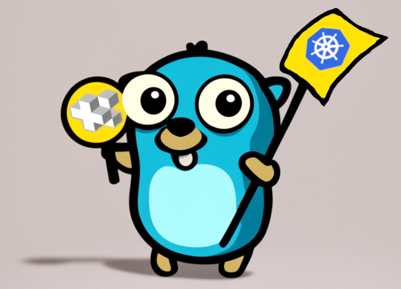

# kr8+

**kr8+** is an opinionated Kubernetes cluster configuration management tool designed to simplify and standardize the process of managing Kubernetes clusters.
By leveraging best practices and providing a structured approach, **kr8+** helps DevOps teams streamline their workflows and maintain consistency across multiple environments.

**kr8+** consists of:

- **kr8+** - a Go binary for rendering manifests
- [go-jsonnet](https://pkg.go.dev/github.com/google/go-jsonnet) `v0.20.0`
- [ghodss/yaml](https://github.com/ghodss/yaml) `v1.0.0`
- [Grafana/tanka helm](https://github.com/grafana/tanka/pkg/helm) `v0.27.1`
- [kubernetes/kompose](https://github.com/kubernetes/kompose) `v1.35.0`
- [Masterminds/sprig v3 Template Library](https://pkg.go.dev/github.com/Masterminds/sprig#section-readme) - [Template Documentation](https://masterminds.github.io/sprig/) `v3.2.3`

## Why use kr8+?

* **Standardization**: Ensures consistency across Kubernetes clusters, reducing errors and improving maintainability.
* **Simplicity**: Provides a straightforward approach to complex Kubernetes configurations, making it easier for teams to adopt.
* **Scalability**: Designed to support clusters of all sizes, from simple single-node setups to large-scale production environments.

To get started, check out one of the following:

* [Installation](installation.md)
* [Examples](https://github.com/ice-bergtech/kr8/tree/main/example)
* [Concepts](concepts/overview.md)
* [Cluster concept](concepts/clusters.md)
* [Component Concept](concepts/components.md)

For documentation of the code, see the godoc directory:

* [cmd](godoc/kr8p-cmd.md) - how kr8+ processes commands and flags
* [pkg/jvm](godoc/kr8p-jsonnet.md) - how kr8+ processes jsonnet
* [pkg/types](godoc/kr8p-types.md) - standard types used by kr8+
* [pkg/util](godoc/kr8p-util.md) - utility functions used by kr8+

